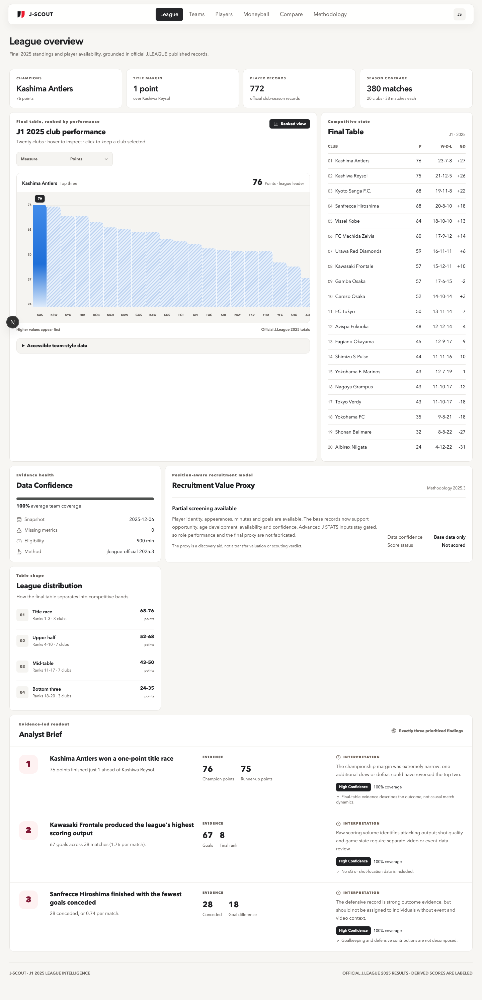
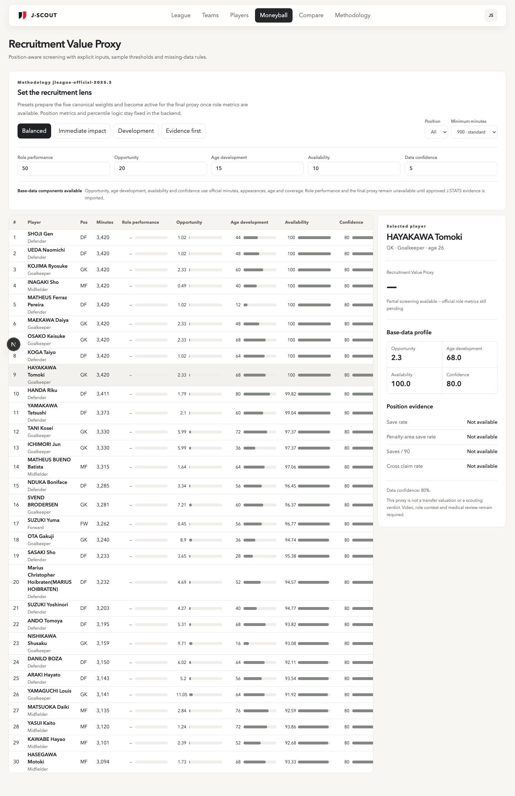
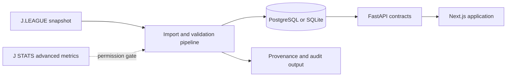

# J-Scout

**Evidence-first recruitment intelligence for the 2025 J1 League.**

J-Scout turns official league records into an auditable scouting workspace. It combines a responsive Next.js interface, a FastAPI service, a relational player-season model, and a repeatable data pipeline without presenting missing statistics as facts.



## Project snapshot

| Scope            | Current implementation                                          |
| ---------------- | --------------------------------------------------------------- |
| Competition      | 2025 Meiji Yasuda J1 League                                     |
| Clubs            | 20 official clubs                                               |
| Player data      | 736 unique players and 772 player-club-season records           |
| Product surfaces | League, Teams, Players, Recruitment Value, Compare, Methodology |
| Backend          | FastAPI, SQLAlchemy, Alembic                                    |
| Database         | PostgreSQL in the full stack; SQLite for local learning         |
| Validation       | 17 backend, 27 frontend, and 14 browser tests                   |

The difference between 736 players and 772 player-season records is intentional: a transferred player keeps one identity while each club spell remains a separate season record.

## The problem

Football dashboards often mix published facts, inferred metrics, and model output without showing where each number came from. That makes a polished interface easy to build but difficult to trust.

J-Scout treats provenance and missing data as product features. Every value belongs to one of three layers:

1. **Official facts** — standings, player identity, appearances, minutes, and goals from the frozen J.LEAGUE 2025 snapshot.
2. **J-Scout derivations** — opportunity, age-development, availability, and data-confidence components calculated from those official base records.
3. **Permission-gated evidence** — advanced J STATS fields required for position-specific Role Performance and the final Recruitment Value Proxy.

If the evidence is unavailable, the product shows `Not scored`; it does not silently replace nulls with zero or manufacture a ranking.

## What the product demonstrates

- A dense but readable league overview built around decisions rather than decorative charts.
- All 20 official J1 clubs and hundreds of real 2025 player-season records.
- Position-aware player evidence for GK, DF, MF, and FW cohorts.
- Transfer-safe identity modelling: player identity is separate from club-season membership.
- A transparent partial-scoring state while advanced role metrics remain gated.
- Player comparison that blocks invalid cross-position score claims.
- Cursor pagination, filters, explicit source status, and API contracts validated with Zod and Pydantic.
- Responsive, accessible workflows tested on desktop and mobile.



## Recruitment Value methodology

The current methodology is `jleague-official-2025.3`.

Base records can support four screening components before advanced data is available:

- **Opportunity** combines inverse minute and appearance percentiles within the same position cohort.
- **Age development** is explicitly an age-runway proxy, not a career forecast.
- **Availability** combines a player's share of available minutes and appearances.
- **Data confidence** combines base-data coverage, sample reliability, and role-profile coverage.

**Role Performance remains unavailable** until approved advanced J STATS values are imported. Consequently, the final Recruitment Value Proxy also remains unavailable. The weighting controls are ready for the complete model, but partial components never produce a misleading final score.

The complete formulas, assumptions, and worked examples are documented in [Recruitment Value Proxy](docs/learning/14-recruitment-value-proxy.md).

## Data rights and limitations

J-Scout uses a fail-closed source policy:

| Data group                            | Status            | Product behaviour                                      |
| ------------------------------------- | ----------------- | ------------------------------------------------------ |
| Final standings                       | Official snapshot | Displayed as published facts                           |
| Identity, appearances, minutes, goals | Official snapshot | Displayed as published facts                           |
| Advanced J STATS metrics              | `research_only`   | Schema and parser exist; bulk values are not published |
| Market values                         | Unavailable       | No price or valuation claim is made                    |

This project is a portfolio case study and analytical screening tool. It is not a transfer valuation, prediction system, medical assessment, or replacement for video and human scouting.

See the [source register](docs/product/jleague-player-statistics-source-register.md) for the metric-by-metric usage boundary.

## Architecture



```text
app/                              Next.js routes
components/                       App shell, dashboard modules, charts
features/api/                     FastAPI-to-frontend contract adapter
features/league-intelligence/     Domain types, validation, analytics
data/jleague/2025.json            Frozen official-data snapshot
data/jleague/metric-catalog.json  Advanced-metric contract and usage gate
scripts/import_jleague_2025.py    Repeatable official-source importer
scripts/jleague_stats.py          Offline parser and identity join
apps/api/app/                     FastAPI, SQLAlchemy models, scoring
apps/api/alembic/                 Database migrations
apps/api/tests/                   Backend contract and scoring tests
docs/learning/                    Implementation tutorials in Indonesian
e2e/                              Browser, responsive, and accessibility tests
```

## Run locally

Requirements: Node.js 20+, npm 10+, Python 3.12+, `uv`, and Docker Desktop for PostgreSQL.

```bash
npm install
cp .env.example .env.local
docker compose up -d postgres
cd apps/api
uv sync
uv run alembic upgrade head
uv run uvicorn app.main:app --reload --port 8000
```

In a second terminal:

```bash
npm run dev
```

- Application: `http://127.0.0.1:3000`
- API documentation: `http://127.0.0.1:8000/docs`
- Health check: `http://127.0.0.1:8000/api/v1/health`

For local learning without Docker:

```bash
cd apps/api
DATABASE_URL=sqlite+pysqlite:///./jscout-dev.db uv run alembic upgrade head
DATABASE_URL=sqlite+pysqlite:///./jscout-dev.db uv run uvicorn app.main:app --reload --port 8000
```

The frontend includes a validated local fallback, so the product remains inspectable while the API is offline.

## Quality checks

```bash
npm test
npm run lint
npm run build
npm run e2e
npm run api:test
```

The suite covers scoring rules, transfer identity, API contracts, migrations, filters, responsive layouts, missing-data states, accessibility, and viewport overflow.

## API surface

- `GET /api/v1/league/2025/overview`
- `GET /api/v1/teams`
- `GET /api/v1/players`
- `GET /api/v1/players/compare?ids=1,2`
- `POST /api/v1/recruitment/rank`
- `GET /api/v1/methodology`
- `GET /api/v1/data-coverage`

`POST /api/v1/moneyball/rank` remains as a one-release compatibility route and returns deprecation headers.

## Learning notes

The repository includes a chapter-by-chapter implementation guide. Useful starting points:

- [FastAPI contracts](docs/learning/08-fastapi-contracts.md)
- [PostgreSQL and migrations](docs/learning/09-postgresql-and-migrations.md)
- [Frontend API adapter](docs/learning/10-frontend-api-adapter.md)
- [Official J1 2025 import](docs/learning/11-official-jleague-data-import.md)
- [Official player-statistics pipeline](docs/learning/13-official-player-stats-pipeline.md)
- [Recruitment Value Proxy](docs/learning/14-recruitment-value-proxy.md)
